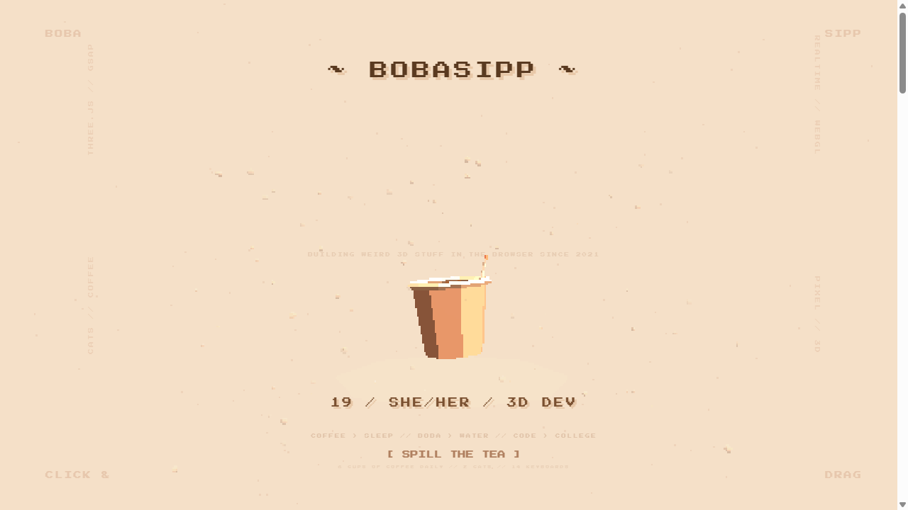

# 🧋 BOBAWEB

> 19 / she/her / 3D dev — a pixel-art interactive portfolio built with Three.js.



**Live:** [bobasipp.github.io/BobaWeb](https://bobasipp.github.io/BobaWeb)

---

## What is this?

A 3D portfolio website featuring an interactive boba cup you can drag, spill, and watch refill. Built entirely with Three.js, raw CSS, and sheer force of will. No frameworks, no bloat.

---

## Features

- **3D Boba Cup** — fully modeled in Three.js with CylinderGeometry body, tea fill, 15 boba pearls, straw, rim, and rim-glow shader
- **Drag to Spill** — click and drag the cup to rotate it; fast flicks spill particles and drain the tea level
- **Auto Refill** — tea slowly recovers when idle
- **Pixel Art Aesthetic** — low-res rendering (`PIXEL_SCALE = 2.5`), nearest-neighbor upscaling, Press Start 2P font, beige/orange palette
- **Scroll-Driven Animation** — cup spins and tilts based on scroll progress
- **Custom Cursor** — a little boba cup follows your mouse with motion blur and spill trail
- **Background Particles** — 70 flying boba balls drifting in the background
- **Snap Scroll Sections** — 6 sections with CSS scroll-snap

---

## Sections

| # | Section | Content |
|---|---------|---------|
| 0 | Intro | Title, taglines, 4 floating labels |
| 1 | About | Bio, stats (age, height, keyboards, coffee, cats), pronouns |
| 2 | Skills | 24 skill tags in 3 groups + useless talents |
| 3 | Projects | 5 project cards with descriptions & tech tags |
| 4 | Brainrot | Random facts, shower thoughts, confessions |
| 5 | Contact | Where to find me, availability, meme tax |

---

## Screenshots

| Page | Preview |
|------|---------|
| Intro |  |
| About | *(coming soon)* |
| Skills | *(coming soon)* |
| Projects | *(coming soon)* |
| Brainrot | *(coming soon)* |
| Contact | *(coming soon)* |

---

## Tech Stack

| Thing | What |
|-------|------|
| 3D Engine | Three.js r128 |
| Scroll | CSS scroll-snap + JS |
| Cursor | Custom DOM element |
| Particles | Raw Three.js geometry |
| Font | Press Start 2P (Google Fonts) |
| Hosting | GitHub Pages |

---

## Still Needs Work ⚠️

This project is **not finished**. Here's what's left:

### High Priority
- [ ] **Mobile responsiveness** — scroll + drag on mobile is still janky, especially touch-scroll vs touch-drag conflict
- [ ] **Accessibility** — screen readers, keyboard navigation, reduced motion media query
- [ ] **Loading state** — Three.js takes a sec to load; needs a splash/loading screen so it doesn't flash empty
- [ ] **Performance** — PIXEL_SCALE 2.5 is aggressive on high-DPI screens; needs adaptive pixel scale based on device

### Medium Priority
- [x] **Screenshots** — intro screenshot captured; rest still need headless WebGL rendering fix
- [x] **GitHub Pages deploy** — live at https://bobasipp.github.io/BobaWeb/
- [ ] **404 page** — because why not make a 3D 404 page too
- [ ] **Analytics** — basic privacy-friendly visitor count would be cute

### Low Priority / Would Be Nice
- [ ] **Sound effects** — bubble pop, spill sound, ambient lo-fi track (muted by default, toggleable)
- [ ] **Theme toggle** — dark mode (midnight boba??)
- [ ] **More cat content** — the people demand Pixel and Shader photos
- [ ] **Keyboard controls** — arrow keys to scroll sections, space to "spill" the cup
- [ ] **Progressive enhancement** — graceful fallback for browsers that can't run WebGL
- [ ] **Seasonal events** — holiday-themed cup decorations

---

## Running Locally

Just open `index.html` in a browser. No build step, no npm install.

```bash
git clone https://github.com/BobaSipp/BobaWeb.git
cd BobaWeb
# open index.html in your browser
```

---

## Credits

Built by [@BobaSipp](https://github.com/BobaSipp) with love, coffee, and bad life choices.  
Two cats named Pixel and Shader supervised (screamed at the wall while I coded).  
14 mechanical keyboards were harmed in the making of this website.

---

*BOBAWEB / 2026 — keep sipping*
